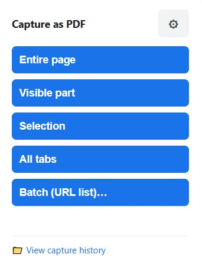
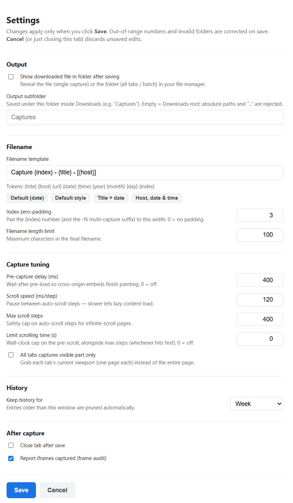

# CDP Full-Page PDF

A Chrome extension (Manifest V3) that captures web pages as **PDFs** with **selectable
text** and **clickable embedded links** — using the Chrome DevTools Protocol
(`chrome.debugger` → `Page.printToPDF`). Capture the **entire page**, just the **visible
part**, a single **picked element**, **all open tabs**, or a pasted **batch of URLs**.

Unlike screenshot-stitching tools, it renders the real document once, so there's no
tiling, no repeated viewport, and no flattened image — links and text are preserved.

## Screenshots

| Popup — capture modes | Settings page |
|:---:|:---:|
|  |  |

## Features

- **True full-page capture** — the whole scrollable page, not just the viewport.
- **Selectable, searchable text** — real PDF text, not an image.
- **Clickable links** — hyperlinks are preserved and point to their original URLs.
- **Screen-faithful rendering** — screen media + backgrounds, so colors and layout
  match what you see in the browser (not a stripped-down print stylesheet).
- **Single tall page** — one continuous page sized to the full content, for a
  screenshot-like feel. Falls back to paginated Letter pages when a page exceeds
  Chrome's ~200 in single-page limit.
- **Lazy-content pre-load** — auto-scrolls to trigger lazy-loaded images/sections
  before capturing, then restores your scroll position.
- **Cancelable** — the capture button becomes a **Stop** button while running; stopping
  aborts immediately, saves nothing, detaches the debugger, and restores your scroll.
- **Dedicated settings page** (⚙ → opens its own tab) with an explicit **Save** / **Cancel**
  model — edit freely; nothing is persisted until you click Save, and out-of-range numbers
  and invalid folders are corrected on save.
- **Five capture modes** (popup menu) — **Entire page**, **Visible part** (current viewport
  as one page), **Selection** (point-and-click element picker), **All tabs** (one PDF per
  tab in the window), and **Batch** (paste a URL list, captured unattended one at a time).
  Every mode produces a real selectable-text PDF.
- **Workflow/config** (settings page) — numeric capture tuning (pre-capture delay, scroll
  speed, max scroll steps, **scroll-time cap**), **filename templates** with tokens
  (`{title} {host} {url} {date} {time} {year} {month} {day} {index}`) plus **one-click
  presets** (incl. a descriptive title/host/index style), **index zero-padding** and a **filename length
  limit**, **output subfolder**, **show file in folder after saving**, **all-tabs
  visible-only**, **history retention**, **close tab after save**, and a **frame audit**.
- **Capture history** — every successful capture is recorded (title, site, date, filename)
  and listed on a history page with one-click **Open** / **Show**, plus **Clear all**.
  Old entries are pruned automatically by your chosen **retention** window. Metadata only —
  files stay in your Downloads folder.

## Install (unpacked)

1. Open `chrome://extensions`.
2. Enable **Developer mode** (top-right).
3. Click **Load unpacked** and select this folder.
4. The extension appears as **CDP Full-Page PDF**.

## Usage

Click the extension's toolbar icon to open the **capture menu**, then choose a mode:

- **Entire page** — the full scrollable document as one tall PDF (paginates if taller than
  Chrome's ~200 in single-page limit).
- **Visible part** — just what's on screen right now, as a one-page PDF.
- **Selection** — hover to highlight elements (devtools-style), click one to capture just
  that element; Escape or right-click cancels.
- **All tabs** — one PDF per capturable tab in the current window (internal pages skipped),
  with live progress.
- **Batch (URL list)…** — opens a page where you paste URLs; each is captured unattended in
  its own background tab, one at a time.

While a capture runs, the menu becomes a red **Stop** button — stopping aborts immediately,
saves nothing, detaches the debugger, reverts any DOM changes, and restores your scroll.

The **⚙ gear** opens the **settings page** in its own tab. Edit freely and click **Save** to
apply (nothing is persisted until you do; **Cancel** or closing the tab discards). Options:

- **Output** — *show downloaded file in folder after saving* (reveals the file for a single
  capture, the folder once for all-tabs/batch), and an *output subfolder* under Downloads
  (e.g. `Captures`; empty = Downloads root; absolute paths and `..` are rejected).
- **Filename** — the *template* (tokens like `{title} {host} {date} {index}`), one-click
  *presets* (incl. a title/host/index style), *index zero-padding* (default 3 → `001`), and a
  *filename length limit* (default 100).
- **Capture tuning** — *pre-capture delay*, *scroll speed*, *max scroll steps*, a
  *scroll-time cap* (seconds; 0 = off), and *all tabs captures visible part only*.
- **History** — *retention* window (Week / 30 days / 3 months / 6 months / Year / All); older
  entries are pruned automatically.
- **After capture** — *close tab after save* and the *frame audit* toggle.

**📁 View capture history** lists past captures with one-click **Open** / **Show** and
**Clear all**.

Internal pages (`chrome://`, `edge://`, `about:`, extension pages) cannot be captured and are
rejected with a clear message.

## How it works

```
popup ── CAPTURE_FULL_PAGE {mode} ─▶ service worker  (holds a CancellationToken)
        ── CANCEL_CAPTURE ─────────▶      │  token.cancel() → abort signal
                                          │
                            mode router ──┤
                                          ├─ PagePreparer  → auto-scroll to load lazy content, restore scroll
                                          ├─ (visible/selection) ElementPicker / DomIsolation → shift target to origin
                                          ├─ PdfCapturer   → CDP: screen-media emulation → layout metrics
                                          │                       → DimensionCalculator → Page.printToPDF
                                          ├─ Downloader    → render filename template → save PDF
                                          └─ History       → record {title, url, host, date, filename}
```

A single-page capture (entire / visible / selection) is clamped to `pageRanges: "1"` so a
sub-pixel print-layout overflow can't add a trailing blank page. `printToPDF` has no clip,
so the **sub-region modes work by changing the DOM** — translate the viewport or picked
element to the origin and hide everything else — rather than cropping; the page is restored
exactly afterward. The **Stop** button sends `CANCEL_CAPTURE`, aborting the token: auto-scroll
bails out, the debugger detaches early (interrupting `printToPDF`), DOM changes are reverted,
and no file is saved.

## Project structure

| File | Responsibility |
|------|----------------|
| `manifest.json` | MV3 config; permissions; module service worker; icon declarations |
| `icons/` | Toolbar / store icons (16 · 32 · 48 · 128 PNG) |
| `background.js` | Service worker — mode router + handlers (entire/visible/selection/all-tabs/batch); orchestrates prepare → capture → download → record |
| `popup.html` / `popup.js` | Toolbar popup: mode menu, Stop, settings gear (opens the settings page), history link |
| `settings.html` / `settings.js` | Settings page — explicit Save/Cancel form over all persisted options |
| `batch.html` / `batch.js` | Batch page — paste a URL list, run/stop, progress |
| `history.html` / `history.js` | History page — list past captures, Open/Show, clear all |
| `src/cancellation.js` | `CancellationToken` (AbortController wrapper); powers the Stop button |
| `src/settings.js` | Persisted settings + pure clamp/merge/validate (tuning, template, output, retention, toggles) + `validateSubfolder` over `chrome.storage` |
| `src/history.js` | Capture history — pure shape/merge + `prune` (retention) helpers + `chrome.storage.local` record/list/clear |
| `src/urlList.js` | Pure parser: pasted blob → clean, de-duplicated http(s) URL list |
| `src/filenameTemplate.js` | Pure template render + filename sanitize (token substitution, index padding, length cap) + presets + output-path assembly |
| `src/frameAuditor.js` | Pure iframe classifier (same-origin vs cross-origin from the CDP frame tree) |
| `src/domIsolation.js` | Injected viewport translate-to-origin + element isolation (visible/selection) |
| `src/elementPicker.js` | Injected hover-highlight + click-to-pick element picker |
| `src/cdpSession.js` | Promisified `chrome.debugger` wrapper; guaranteed detach; early detach on abort |
| `src/pagePreparer.js` | Injected auto-scroll lazy-load (tunable speed/steps) + scroll restore |
| `src/dimensionCalculator.js` | Pure paper-size logic (px→inch, single-page vs. paginate) |
| `src/pdfCapturer.js` | CDP `Page.printToPDF` orchestration (optional dimension override) |
| `src/downloader.js` | Template/timestamped filename + optional subfolder + `chrome.downloads` (returns the download id for reveal-in-folder); guarantees the name via an `onDeterminingFilename` hook (the `filename` option alone is unreliable for `data:` URLs / when other download extensions are installed) |

## Permissions

| Permission | Why |
|------------|-----|
| `debugger` | Drive CDP `Page.printToPDF` / layout metrics |
| `scripting` | Inject the auto-scroll lazy-load routine |
| `downloads` | Save the resulting PDF |
| `downloads.open` | Re-open a past capture from the history page (one-click Open) |
| `tabs` | Read tab URLs/titles (internal-page guard, all-tabs, batch background tabs) |
| `activeTab` | Operate on the current tab on user action |
| `storage` | Persist settings + capture history metadata |
| `host_permissions: <all_urls>` | Inject pre-load / drive the debugger on all-tabs and batch (foreign) tabs |

## Limitations

- Very large pages download via a base64 `data:` URL; an extremely large PDF could hit
  a data-URL size limit.
- Same-origin iframes are pre-scrolled (injection runs in all reachable frames).
  Cross-origin iframes can't be driven (browser security) — they still render into
  the PDF if already loaded, but their lazy content and inner links aren't captured.
- Pages taller than Chrome's ~200 in single-page cap fall back to paginated output.
- **Virtualized / infinite-scroll feeds** (e.g. Instagram post grids, long social
  timelines) may capture incompletely. The capture is a single `Page.printToPDF` of the
  live DOM, so it can only include what's actually in the DOM at print time. Sites that
  *unmount* off-screen items (windowing) or load content after our pre-scroll never have
  all items mounted at once, so parts of the feed can come out blank or missing. This is
  the trade-off for a real text/vector PDF — image-stitching tools avoid it
  only by producing a flattened screenshot. Raising the **pre-capture delay** (⚙) helps when
  the cause is slow loading rather than windowing.
- **All tabs** and **Batch** produce **one PDF per capture** — there's no merged-PDF output.
- **History is metadata only.** It re-opens files via Chrome's own download list, so moving
  or deleting a PDF in Downloads makes that entry show "file not found".

## Development

- **No build step and no dependencies** — load the folder unpacked as-is.
- Pure modules are exercised with Node during development (no browser needed):
  `dimensionCalculator`, `settings` (clamp/merge + `validateSubfolder`), `urlList`,
  `filenameTemplate` (render + `padIndex` + `buildOutputPath` + presets), and `history`
  (shape/merge + `prune`). `node --check <file>` syntax-checks any module.
- After editing, reload the extension from `chrome://extensions` (the **↻** button).
- Toolbar/store icons live in `icons/`, referenced by `manifest.json`.
- See the `PRD-*.md` and `PLAN-*.md` docs for requirements and build plans, and `VERIFY.md`
  for the manual in-browser verification checklist (75 checks across all modes + config).
